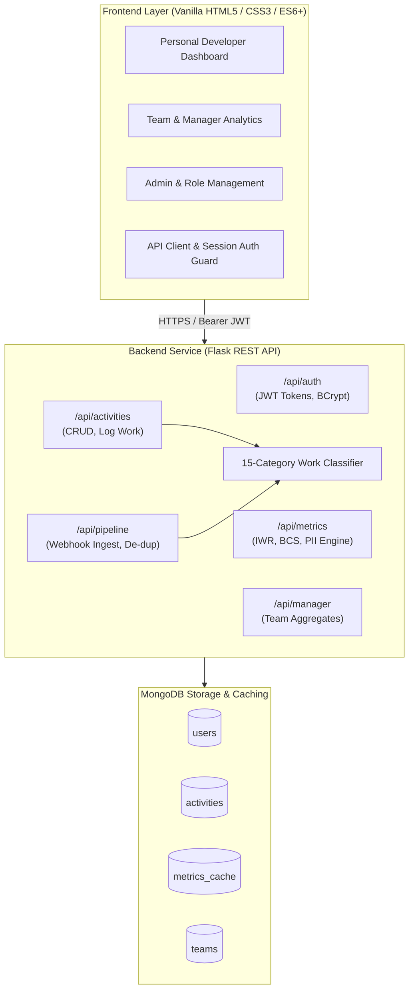

<div align="center">

# 👁️ InvisiWork

### Real-Time Invisible Work Analytics System for Engineering Teams

[](https://www.python.org/)
[](https://flask.palletsprojects.com/)
[](https://www.mongodb.com/)
[](https://developer.mozilla.org/)
[](https://docs.pytest.org/)
[](LICENSE)

<p align="center">
  <b>Making the unseen efforts of software engineers visible, measurable, and rewarded.</b>
</p>

[Explore Dashboards](#-interactive-dashboards) •
[Core Metrics](#-core-metrics--formulas) •
[Architecture](#-system-architecture) •
[Quick Start](#-quick-start) •
[API Reference](#-api-reference) •
[Documentation](#-technical-specifications)

</div>

---

## 📌 Problem Overview

Traditional engineering analytics (commits, closed Jira tickets, PR counts) only capture the **tip of the productivity iceberg**. Software engineers spend over **40–60%** of their working hours on vital tasks that never show up on sprint boards:

- Thorough code reviews and architecture critiques
- Unblocking teammates and 1-on-1 mentoring
- Deep production debugging and incident triage
- Cross-team alignment, RFC drafting, and documentation
- Technical debt mitigation and infrastructure tuning

### The Cost of Ignoring Invisible Work:
1. **Unfair Performance Evaluations**: High-leverage glue engineers who empower others appear "less productive" on paper.
2. **Accelerated Burnout**: Developers burdened with urgent unblocking and invisible tasks work overtime to meet visible output expectations.
3. **Team Knowledge Silos**: Discourages knowledge-sharing in favor of ticket velocity.

**InvisiWork solves this** by providing a unified, double-loop system where engineers log and classify all work, managers gain real-time visibility into workload distribution, and early burnout risks are flagged proactively.

---

## 📐 Core Metrics & Formulas

```
                                  WORK BREAKDOWN
  ┌──────────────────────────────────────┬──────────────────────────────────────┐
  │         VISIBLE WORK (35-65%)        │        INVISIBLE WORK (35-65%)       │
  ├──────────────────────────────────────┼──────────────────────────────────────┤
  │ • Feature Development                │ • Code Reviews & Mentorship          │
  │ • Bug Fixes (Tracked Tickets)        │ • Non-Ticket Debugging & Triage      │
  │ • Formal QA & Testing                │ • Documentation & Knowledge Sharing  │
  │                                      │ • Incident Response & Planning       │
  └──────────────────────────────────────┴──────────────────────────────────────┘
```

### 1. Invisible Work Ratio (IWR)
Measures the proportion of time spent on invisible tasks relative to total logged effort:
$$\text{IWR} = \left( \frac{\text{Invisible Work Hours}}{\text{Total Logged Hours}} \right) \times 100$$
- **Healthy Range**: $30\% - 60\%$ (Balanced contribution)
- **Elevated**: $60\% - 75\%$ (Heavy invisible load; requires review)
- **Critical**: $> 75\%$ (Immediate risk of burnout or delivery bottleneck)

### 2. Burnout Correlation Score (BCS)
A composite $0 - 100$ index combining workload velocity, sustained invisible work ratio, and context-switching penalties:
- **Low Risk ($0 - 39$)**: Sustainable pace and healthy work distribution.
- **Moderate Risk ($40 - 69$)**: Workload pressure rising; review assignments.
- **High Risk ($70 - 100$)**: Severe burnout hazard; managerial intervention advised.

### 3. Personal Impact Index (PII)
A holistic $0 - 100$ developer contribution score reflecting volume, balance across visible and invisible streams, and sustainability over time.

---

## 🏛️ System Architecture



---

## 🖥️ Interactive Dashboards

The frontend is intentionally designed using modern, zero-dependency Vanilla CSS & ES6 JavaScript with dark-mode persistence, micro-interactions, and responsive layouts:

| View | Target User | Description |
| :--- | :--- | :--- |
| **`personal-dashboard.html`** | Developers | Personal IWR / BCS gauges, quick work logger, recent activity feed, weekly trend chart. |
| **`team-dashboard.html`** | Teams | Aggregated team velocity, visible vs. invisible balance breakdown, and peer comparison. |
| **`manager-dashboard.html`** | Leads / Managers | Team member health matrix, burnout risk alerts, drill-down activity logs. |
| **`weekly-summary.html`** | All | Weekly retrospective report with export-ready stats for sprint reviews and 1-on-1s. |
| **`reports.html`** | Leads & Executives | Customizable range analytics, department-level distribution, and trend analysis. |
| **`admin.html`** | Administrators | Role assignment, user activation, team provisioning, and security management. |

---

## 📂 Repository Structure

```
.
├── invisiwork/                   # Frontend Web Application
│   ├── index.html                # Platform landing & login portal
│   ├── dashboard.html            # Main activity & work logging dashboard
│   ├── personal-dashboard.html   # Developer personal analytics & metrics
│   ├── team-dashboard.html       # Team distribution & comparison view
│   ├── manager-dashboard.html    # Manager health overview & burnout alerts
│   ├── weekly-summary.html       # Weekly review & retrospective insights
│   ├── reports.html              # Custom report generator
│   ├── admin.html                # Team administration & role management
│   ├── css/                      # Modular design system (variables, themes, components)
│   └── js/                       # API client, auth guards, mock store & UI logic
├── invisiwork-backend/           # Backend REST API
│   ├── run.py                    # Server startup script
│   ├── requirements.txt          # Python dependencies
│   ├── .env.example              # Environment variables template
│   ├── app/
│   │   ├── __init__.py           # Application Factory (create_app)
│   │   ├── config.py             # Development, testing, and production configs
│   │   ├── extensions.py         # Dynamic extensions proxy (CORS, MongoProxy)
│   │   ├── auth/                 # JWT authentication, register, login, teams
│   │   ├── activities/           # Work logging & 15-category classification
│   │   ├── metrics/              # IWR, BCS, and PII calculation engine
│   │   ├── manager/              # Manager endpoints & team-wide metrics
│   │   ├── admin/                # Administrative endpoints
│   │   └── pipeline/             # Webhook ingestion, scheduler & deduplication
│   └── tests/                    # Comprehensive Pytest test suite (86 passing tests)
├── docs/                         # Technical Specifications
│   ├── FRONTEND_SPEC.md          # Complete frontend build brief & design system
│   └── BACKEND_SPEC.md           # Backend architecture, schemas & data pipeline
├── LICENSE                       # MIT License
└── README.md                     # Project documentation
```

---

## 🚀 Quick Start

### Prerequisites
- Python 3.10 or higher
- MongoDB instance (local `mongodb://localhost:27017` or MongoDB Atlas)
- Modern web browser (Chrome, Safari, Firefox, Edge)

---

### 1. Backend Setup

```bash
# Navigate to the backend directory
cd invisiwork-backend

# Create and activate a virtual environment
python3 -m venv .venv
source .venv/bin/activate       # On Windows: .venv\Scripts\activate

# Install dependencies
pip install -r requirements.txt

# Configure environment variables
cp .env.example .env

# Run database tests to verify setup
pytest tests/ -v

# Start the Flask API server
python run.py
```

The REST API will be active at: `http://127.0.0.1:5000`

---

### 2. Frontend Setup

The frontend is built with pure web standards (HTML5, Vanilla CSS, ES6+ JS) and requires **no build step or bundler**:

```bash
# In a new terminal window, navigate to the frontend directory
cd invisiwork

# Serve using Python's built-in HTTP server (or any static server)
python3 -m http.server 3000
```

Open your browser at `http://localhost:3000` or open `index.html` directly.

---

## 🧪 Running Tests

The backend includes a comprehensive test suite covering authentication, JWT token refresh, authorization boundaries, work classification, metrics computation, and pipeline ingestion:

```bash
cd invisiwork-backend
pytest tests/ -v
```

```
============================== test session starts ==============================
collected 86 items

tests/test_auth.py ....................                                  [ 23%]
tests/test_classifier.py ...........................                    [ 54%]
tests/test_metrics.py ..........................                         [ 84%]
tests/test_pipeline.py .............                                     [100%]

============================== 86 passed in 3.10s ==============================
```

---

## 🔌 API Reference

All protected endpoints require an `Authorization: Bearer <access_token>` header.

### Authentication (`/api/auth`)
| Method | Endpoint | Description | Auth Required |
| :--- | :--- | :--- | :---: |
| `POST` | `/api/auth/register` | Register developer or manager | No |
| `POST` | `/api/auth/login` | Authenticate and obtain JWT access/refresh tokens | No |
| `POST` | `/api/auth/refresh` | Refresh an expired access token | Refresh Token |
| `GET` | `/api/auth/me` | Fetch current user profile | Yes |
| `POST` | `/api/auth/logout` | Revoke session tokens | Yes |

### Activities (`/api/activities`)
| Method | Endpoint | Description | Auth Required |
| :--- | :--- | :--- | :---: |
| `POST` | `/api/activities` | Log a new activity (classified as visible/invisible) | Yes |
| `GET` | `/api/activities` | List logged activities with date filters | Yes |
| `GET` | `/api/activities/<id>` | Get single activity details | Yes |
| `DELETE` | `/api/activities/<id>` | Delete an activity | Yes |

### Metrics (`/api/metrics`)
| Method | Endpoint | Description | Auth Required |
| :--- | :--- | :--- | :---: |
| `GET` | `/api/metrics/current` | Retrieve current ISO week IWR, BCS, and PII | Yes |
| `GET` | `/api/metrics/history` | Historical weekly metrics breakdown | Yes |

### Pipeline Ingestion (`/api/pipeline`)
| Method | Endpoint | Description | Auth Required |
| :--- | :--- | :--- | :---: |
| `POST` | `/api/pipeline/ingest` | Ingest form submissions (Google Forms/Sheets) | `X-Pipeline-Secret` |

### Manager Analytics (`/api/manager`)
| Method | Endpoint | Description | Auth Required |
| :--- | :--- | :--- | :---: |
| `GET` | `/api/manager/team` | Team-wide IWR, BCS, and burnout risk distribution | Manager Role |
| `GET` | `/api/manager/member/<id>` | Detailed work breakdown for a specific team member | Manager Role |

---

## 📚 Technical Specifications

Detailed design specifications, schema definitions, and implementation guides are available in the [`docs/`](docs/) directory:

- 📘 [Frontend Design & UI Specification](docs/FRONTEND_SPEC.md) — Comprehensive design token reference, responsive layouts, and user interactions.
- 📙 [Backend Architecture & Data Models](docs/BACKEND_SPEC.md) — RESTful API specifications, database schemas, and metric algorithms.

---

## 📜 License

Distributed under the **MIT License**. See [`LICENSE`](LICENSE) for details.

---

<div align="center">
  <sub>Built with ❤️ for healthier, more balanced engineering teams.</sub>
</div>
